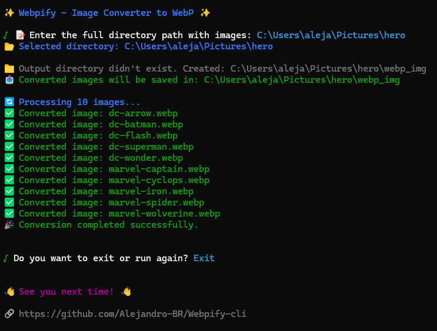

# Webpify - 2.0.0

**Webpify** es una herramienta de terminal escrita en **Node.js** que convierte tus imágenes PNG, JPG, HEIC y HEIF a formato **WebP**, un formato de imagen optimizado que ofrece compresión sin pérdida, ideal para la web.

¡Convierte tus fotos en imágenes más ligeras y que cargan más rápido!


## ⭐ Características

- **Conversión rápida y eficiente** de imágenes PNG y JPG a WebP.
- **Compatibilidad con formatos HEIC y HEIF**, convertidos primero a JPG y luego a WebP.
- **Fácil de usar** desde la línea de comandos.
- **Soporte multilingüe:** Compatible con inglés y español.
- **Control de rutas de entrada y salida:** Define carpetas de entrada y salida directamente desde la CLI con flags.
- **Ayuda desde la línea de comandos y visualización de versión:** Usa `--help` para ver opciones disponibles y `--version` para consultar la versión actual.
- **Modo automático** para convertir imágenes del directorio actual con `--auto`.
- Muestra información del proyecto y autor con `--about`.
- Experiencia de CLI mejorada: Comandos claros e intuitivos con flags como `--input`, `--output`, `--es`, `--auto`, etc.
- **Optimización de imágenes** para mejorar el rendimiento de tus sitios web.

## Vista Previa



## 💻 Instalación

Para instalar Webpify de forma global en tu sistema, ejecuta el siguiente comando:

```bash
npm i -g webpify-cli
```

Esto instalará Webpify globalmente, lo que te permitirá usarlo desde cualquier directorio de tu terminal simplemente escribiendo:

```bash
webpify
```

Si prefieres no instalarlo globalmente, también puedes ejecutarlo con npx:

```bash
npx webpify-cli
```

## 🛠️ Uso

Puedes usar **Webpify** de dos formas: en **modo interactivo** (sin flags) o mediante **opciones desde la línea de comandos**.

### Modo Interactivo (sin flags)

Simplemente ejecuta el comando sin ningún flag y Webpify te guiará paso a paso con un menú interactivo:

```bash
webpify
```

---

### Comandos y Opciones

- `--input "<ruta>"`  
  Convierte automáticamente todas las imágenes en la carpeta especificada.

  ```bash
  webpify --input "ruta/a/imagenes"
  ```

- `--output "<ruta>"`  
  Establece una carpeta personalizada para guardar las imágenes convertidas.  
  Se puede combinar con:

  - `--input`
  - `--auto`
  - **Modo interactivo**

  ```bash
  webpify --input "ruta/a/imagenes" --output "ruta/a/convertidas"
  webpify --auto --output "ruta/a/webp"
  webpify --output "ruta/a/salida"
  ```

- `--auto`  
  Convierte automáticamente todas las imágenes en el directorio actual sin mostrar el menú.  
  Ejemplo:

  ```bash
  webpify --auto
  ```

- `--es`  
  Cambia el idioma de la interfaz a español.  
  **Puede usarse junto a cualquier otro flag**:

  ```bash
  webpify --es
  ```

- `--about`  
  Muestra información del autor y del proyecto:

  ```bash
  webpify --about
  ```

- `--version` o `-V`  
  Muestra la versión actual de Webpify:

  ```bash
  webpify --version
  ```

- `--help` o `-h`  
  Muestra la ayuda y los comandos disponibles:
  ```bash
  webpify --help
  ```

ℹ️ **Nota:** Si tus rutas contienen espacios, colócalas entre comillas dobles (`" "`).

## 📁 Formatos Compatibles

| Formato de entrada | Formato de salida       |
| ------------------ | ----------------------- |
| PNG                | WebP                    |
| JPG / JPEG         | WebP                    |
| HEIC               | JPG (intermedio) → WebP |
| HEIF               | JPG (intermedio) → WebP |

### 📷 Comparación visual

Aquí tienes un ejemplo visual que muestra el impacto de Webpify utilizando la biblioteca [Sharp](https://github.com/lovell/sharp):

<table> <tr> <th>Original (JPG)</th> <th>Convertido (WebP)</th> </tr> <tr> <td></td> <td></td> </tr> <tr> <td><b>Tamaño:</b> 465 KB</td> <td><b>Tamaño:</b> 200 KB</td> </tr> </table>

WebP reduce el tamaño de las imágenes hasta en un 70 % sin pérdida apreciable de calidad, lo que mejora la velocidad de carga de tus proyectos web.

## 🚀 Novedades en la Versión 2.0.0

- Arquitectura mejorada.
- Soporte para múltiples idiomas (inglés y español).
- Nuevo modo automático con el flag `--auto`.
- CLI mejorada con nuevos flags: `--input`, `--output`, `--es`, `--about`.
- Comandos útiles: versión (`--version` / `-V`) y ayuda (`--help` / `-h`).
- Mejor experiencia de usuario con modos interactivo y no interactivo.

## 🙌 Créditos

[Alejandro Barrionuevo Rosado](https://github.com/Alejandro-BR)

Licencia MIT – © 2025
